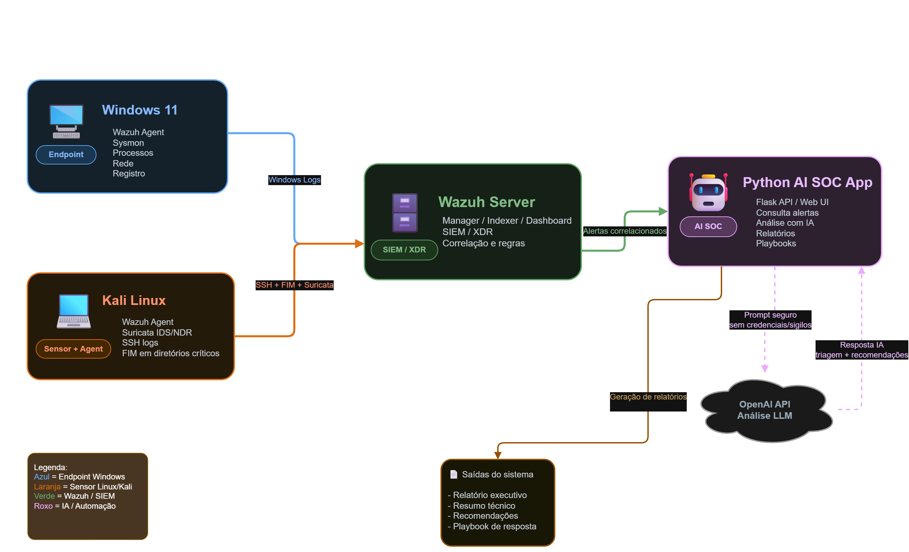

# Wazuh AI SOC Lab

### SIEM, NDR, Sysmon, Active Response, MITRE ATT&CK e Inteligência Artificial para Análise de Alertas SOC


---

## 📌 Visão Geral

Este projeto apresenta a construção de um laboratório de segurança defensiva utilizando o **Wazuh** como plataforma central de SIEM/XDR, integrado com **Suricata IDS/NDR**, **Sysmon no Windows**, **FIM**, detecção de brute force SSH, Active Response, dashboards operacionais e uma interface web com **Inteligência Artificial** para análise automatizada de alertas.

A proposta é simular um ambiente corporativo monitorado por um SOC, onde eventos de rede, endpoint Linux, endpoint Windows e integridade de arquivos são centralizados no Wazuh e analisados por um assistente de IA.

O projeto evoluiu de um laboratório simples de Wazuh para um protótipo de **mini SOC/XDR com IA**, e mais recentemente para uma **prova de conceito de SOCaaS (Security Operations Center as a Service)**, capaz de gerar:

- Relatórios SOC automatizados (técnico e executivo);
- Playbooks de resposta a incidentes;
- Correlação de eventos;
- Mapeamento MITRE ATT&CK;
- Análise dedicada de eventos Sysmon;
- Análise interativa via chat;
- Histórico persistente em SQLite;
- Identificação do analista logado;
- Download de evidências;
- Visão multi-tenant simulada (por cliente), com cadastro editável via banco de dados;
- Painel de SLA simulado (TTD/TTR);
- Enriquecimento de IPs com Threat Intelligence (AbuseIPDB);
- Rate limiting no login e endpoint de health check;
- Logging estruturado com rotação de arquivo;
- Dashboard NDR;
- Dashboard Windows/Sysmon;
- Scripts de automação para geração de eventos de teste;
- Página de apresentação do projeto.

---

## 🎯 Objetivo do Projeto

O objetivo principal é demonstrar como o Wazuh pode ser utilizado como base para um ambiente de monitoramento de segurança, integrando diferentes fontes de telemetria e utilizando IA para auxiliar o analista SOC na triagem, investigação, documentação e resposta a incidentes.

O projeto busca responder perguntas como:

- Houve tentativa de brute force SSH?
- Quais IPs estão envolvidos nos alertas?
- Existem eventos de rede suspeitos?
- Houve alteração de arquivos monitorados?
- Existem eventos Sysmon no Windows?
- Quais processos e command lines foram observados?
- Qual seria a severidade do incidente?
- Quais técnicas MITRE ATT&CK podem estar relacionadas?
- Quais ações o SOC deveria tomar?
- Quais automações podem ser aplicadas?
- Como um mesmo ambiente Wazuh poderia atender múltiplos clientes (SOCaaS)?

---

## 🧱 Arquitetura do Ambiente



<details>
<summary>Ver diagrama em texto (fallback)</summary>

```text
+-------------------------+
|     Windows 11 Agent    |
|  Wazuh Agent + Sysmon   |
| Processos + DNS + Rede  |
+-----------+-------------+
            |
+-----------v-------------+
|      Kali Linux Agent   |
| Wazuh Agent + Suricata  |
| SSH + FIM + NDR Sensor  |
+-----------+-------------+
            |
+-----------v-------------+
|       Wazuh Server      |
| Manager + Indexer + UI  |
| Dashboards + Alertas    |
+-----------+-------------+
            |
+-----------v-------------+
|   Python AI SOC App     |
| Flask + OpenAI API      |
| Chat + SQLite + MITRE   |
| Reports + Playbooks     |
| Multi-tenant + SLA      |
+-------------------------+
```

</details>

---

## 🔐 Componentes Utilizados

### SIEM/XDR

- Wazuh 4.x OVA;
- Wazuh Manager;
- Wazuh Indexer / OpenSearch;
- Wazuh Dashboard.

### Endpoint Linux

- Kali Linux;
- Wazuh Agent;
- SSH;
- FIM;
- iptables / Active Response;
- Suricata IDS/NDR.

### Endpoint Windows

- Windows 11;
- Wazuh Agent;
- Sysmon;
- Eventos do Windows;
- FIM/registro.

### NDR / IDS

- Suricata;
- Regras ET Open;
- Logs `eve.json`;
- Alertas integrados ao Wazuh.

### Aplicação de IA

- Python;
- Flask;
- OpenAI API;
- Markdown;
- SQLite;
- HTML/CSS;
- Interface estilo terminal/SOC.

---

## 🧠 Funcionalidades Implementadas

### 1. Monitoramento com Wazuh

O Wazuh foi utilizado como plataforma central de coleta, normalização, correlação e visualização dos eventos de segurança.

Eventos monitorados:

- Autenticação SSH;
- Tentativas de login inválidas;
- Brute force;
- Alterações em arquivos;
- Eventos do Suricata;
- Eventos Windows;
- Eventos Sysmon;
- Alertas por severidade;
- Eventos por agente.

---

### 2. Detecção de Brute Force SSH

Foi configurado o monitoramento de tentativas de autenticação SSH no agente Kali Linux.

Exemplos de regras observadas:

| Regra | Descrição |
|---|---|
| `5710` | Attempt to login using a non-existent user |
| `5712` | SSH brute force trying to get access to the system |

Exemplo de teste:

```bash
ssh fakeuser@IP_DO_KALI
```

---

### 3. File Integrity Monitoring - FIM

Foi configurado o monitoramento de integridade de arquivos no Kali Linux.

Diretório monitorado:

```text
/home/kali/monitorado
```

Testes executados:

```bash
mkdir -p /home/kali/monitorado
echo "arquivo criado para teste FIM" > /home/kali/monitorado/producao_teste.txt
echo "alteracao suspeita" >> /home/kali/monitorado/producao_teste.txt
chmod 777 /home/kali/monitorado/producao_teste.txt
rm /home/kali/monitorado/producao_teste.txt
```

Eventos esperados:

```text
File added
File modified
Permissions changed
File deleted
```

---

### 4. Active Response

Foi implementada resposta automática para bloqueio de IP em caso de atividade suspeita.

Fluxo esperado:

```text
Wazuh detecta brute force
        ↓
Active Response executa script
        ↓
iptables bloqueia IP atacante
```

Exemplo de verificação:

```bash
sudo iptables -L INPUT -n
```

Exemplo de regra esperada:

```text
DROP all -- IP_ATACANTE 0.0.0.0/0
```

---

### 5. Integração Suricata + Wazuh

O Suricata foi instalado no Kali Linux como sensor IDS/NDR.

Arquivo de log utilizado:

```text
/var/log/suricata/eve.json
```

Configuração adicionada ao agente Wazuh no Kali:

```xml
<localfile>
  <log_format>json</log_format>
  <location>/var/log/suricata/eve.json</location>
</localfile>
```

Eventos detectados:

- ICMP Ping;
- DHCP com hostname Kali;
- Scans;
- Alertas ET Open;
- Protocolos TCP/UDP/ICMP;
- Assinaturas IDS.

Campos importantes observados:

| Campo | Descrição |
|---|---|
| `data.src_ip` | IP de origem |
| `data.dest_ip` | IP de destino |
| `data.alert.signature` | Assinatura IDS |
| `data.alert.category` | Categoria do alerta |
| `data.alert.severity` | Severidade Suricata |
| `data.proto` | Protocolo detectado |
| `rule.groups` | Grupos da regra Wazuh |

---

### 6. Dashboard NDR

Foi criado um dashboard NDR completo no Wazuh Dashboard, utilizando eventos do Suricata.

Nome do dashboard:

```text
NDR Dashboard - AI SOC Lab
```

Painéis criados:

| Painel | Tipo | Campo |
|---|---|---|
| Total de Alertas Suricata | Metric | Contagem (`rule.groups: suricata`) |
| Alertas ao Longo do Tempo | Area Chart | `timestamp` |
| Top 10 Assinaturas IDS | Horizontal Bar | `data.alert.signature` |
| Top IPs de Origem | Horizontal Bar | `data.src_ip` |
| Top IPs de Destino | Horizontal Bar | `data.dest_ip` |
| Distribuição por Protocolo | Donut | `data.proto` |
| Categoria de Ataque | Donut | `data.alert.category` |
| Severidade dos Alertas | Pie | `data.alert.severity` |
| Top Portas de Destino | Data Table | `data.dest_port` |
| Alertas por Agente | Bar | `agent.name` |

Filtro principal:

```text
rule.groups: suricata
```

> Os painéis de IP de origem/destino excluem endereços de rede irrelevantes para investigação (link-local, multicast, broadcast) para manter o foco em hosts reais.

---

### 7. Integração Sysmon + Wazuh

O Sysmon foi instalado no Windows 11 para ampliar a visibilidade do endpoint.

Eventos úteis do Sysmon:

| Event ID | Descrição |
|---|---|
| 1 | Process Creation |
| 3 | Network Connection |
| 7 | Image Loaded |
| 10 | Process Access |
| 11 | File Create |
| 12/13/14 | Registry Events |
| 22 | DNS Query |

Configuração adicionada ao agente Wazuh no Windows:

```xml
<localfile>
  <location>Microsoft-Windows-Sysmon/Operational</location>
  <log_format>eventchannel</log_format>
</localfile>
```

Campos adicionados à coleta Python:

```text
data.win.system.eventID
data.win.system.channel
data.win.system.providerName
data.win.system.computer
data.win.eventdata.user
data.win.eventdata.image
data.win.eventdata.commandLine
data.win.eventdata.parentImage
data.win.eventdata.parentCommandLine
data.win.eventdata.destinationIp
data.win.eventdata.destinationPort
data.win.eventdata.sourceIp
data.win.eventdata.sourcePort
data.win.eventdata.queryName
```

---

### 8. Dashboard Windows/Sysmon

Foi criado um dashboard dedicado ao endpoint Windows com eventos Sysmon.

Nome do dashboard:

```text
Windows Endpoint / Sysmon - AI SOC Lab
```

Painéis criados:

| Painel | Tipo | Campo |
|---|---|---|
| Total de Eventos Sysmon | Metric | Contagem |
| Eventos ao Longo do Tempo | Area Chart | `timestamp` |
| Severidade dos Eventos | Donut | `rule.level` |
| Eventos por Event ID | Donut | `data.win.system.eventID` |
| Usuários | Donut | `data.win.eventdata.user` |
| Top Processos Executados | Horizontal Bar | `data.win.eventdata.image` |
| Top Parent Process | Horizontal Bar | `data.win.eventdata.parentImage` |
| Regras Mais Acionadas | Horizontal Bar | `rule.description` |
| Top Command Lines | Data Table | `data.win.eventdata.commandLine` |

Filtro principal:

```text
data.win.system.channel: "Microsoft-Windows-Sysmon/Operational"
```

> Um painel de Conexões de Rede (Event ID 3) estava planejado, mas o Sysmon neste host não está configurado para capturar esse tipo de evento — ver seção de Melhorias Futuras.

---

### 9. Aplicação Web com IA — AI SOC Assistant

Foi criada uma interface web em Flask chamada:

```text
AI SOC Assistant
```

A interface permite:

- Login simples;
- Visual estilo terminal/SOC;
- Página sobre o projeto;
- Perguntas livres sobre alertas;
- Geração de relatório SOC (técnico);
- Geração de relatório executivo (linguagem de negócio);
- Geração de playbook de resposta;
- Geração de correlação de incidente;
- Análise dedicada de Sysmon;
- Mapeamento MITRE ATT&CK;
- Visão multi-tenant simulada por cliente;
- Painel de SLA simulado (TTD/TTR);
- Download de relatórios;
- Download de alertas JSON;
- Histórico persistente em SQLite;
- Identificação do analista logado no histórico.

Funções disponíveis no menu:

```text
> resumo_alertas()
> detectar_bruteforce()
> analisar_ndr()
> analisar_fim()
> prioridade_soc()
> gerar_relatorio_soc()
> gerar_relatorio_executivo()
> gerar_playbook_incidente()
> correlacionar_incidente()
> analisar_sysmon()
> baixar_relatorio_ia.md
> baixar_relatorio_executivo.md
> baixar_playbook.md
> baixar_correlacao.md
> baixar_analise_sysmon.md
> baixar_alertas.json
> baixar_historico_soc.db
> abrir_dashboard_ndr()
> abrir_dashboard_sysmon()
> visualizar_clientes()
> gerenciar_clientes()
> visualizar_sla()
> consultar_threat_intel()
> sobre_projeto()
> visualizar_historico()
> limpar_historico()
```

O menu lateral é organizado em seções colapsáveis (Consultas Rápidas, Análises IA, Downloads, Dashboards e Sistema), com o botão de logout fixo no topo, sempre visível.

---

### 10. Multi-Tenant Simulado (Clientes)

Para se aproximar do modelo de operação de uma SOCaaS (Security Operations Center as a Service), o projeto simula múltiplos clientes a partir dos agentes Wazuh conectados — cada agente representa uma organização diferente sendo monitorada.

A interface exibe, por cliente:

- Total de eventos coletados;
- Distribuição por severidade (crítico, alto, médio, baixo);
- Data/hora do último alerta.

Isso demonstra como um único ambiente Wazuh pode ser adaptado para operar múltiplos clientes de forma segregada visualmente, um requisito central de qualquer produto SOCaaS.

---

### 11. Relatório Executivo com IA

Além do relatório técnico (com MITRE ATT&CK, IOCs e termos de SOC), o projeto gera uma versão do relatório em **linguagem de negócio**, voltada para gestores e clientes não técnicos.

O relatório executivo:

- Traduz severidade técnica em impacto de negócio;
- Remove jargão técnico e tabelas técnicas;
- Apresenta nível de risco e ações recomendadas de forma objetiva.

Essa dualidade (relatório técnico + relatório executivo) reflete como uma operação SOCaaS real precisa comunicar o mesmo incidente de formas diferentes, dependendo do público.

---

### 12. Painel de SLA Simulado (TTD/TTR)

O projeto calcula duas métricas operacionais a partir de timestamps reais registrados no histórico:

- **TTD (Tempo de Detecção):** intervalo entre o alerta mais recente do lote e o momento em que a IA gerou a análise;
- **TTR (Tempo de Resposta):** intervalo entre a última análise de um cliente e o playbook de resposta gerado em seguida.

Essas métricas são exibidas por cliente, simulando o tipo de SLA que uma operação SOCaaS real acompanha e reporta para seus clientes.

> São métricas simuladas de laboratório, calculadas em cima de timestamps reais — não um SLA contratual de produção.

---

### 13. Cadastro de Clientes via Banco de Dados

O mapeamento de agente → cliente, inicialmente fixo no código, foi migrado para uma tabela própria (`clientes_map`) no SQLite, com tela de gerenciamento dedicada:

```text
/clientes/gerenciar
```

A tela permite:

- Adicionar um novo mapeamento (agente + nome do cliente);
- Atualizar um mapeamento existente;
- Remover um mapeamento (com confirmação).

Na primeira execução, a tabela é populada automaticamente a partir de um seed inicial — depois disso, toda a gestão é feita pela interface, sem precisar editar código.

---

### 14. Threat Intelligence (AbuseIPDB)

Os IPs de origem mais frequentes nos alertas recentes são enriquecidos com reputação externa via API da AbuseIPDB:

```text
/threat-intel
```

Características:

- IPs de rede privada (RFC 1918) são identificados automaticamente e **não** são consultados (não faz sentido buscar reputação pública de um IP interno);
- Resultados são armazenados em cache no SQLite (tabela `ip_reputacao`) por 24h, evitando estourar o limite gratuito da API;
- Score de reputação (0-100) é exibido com destaque visual (baixo/suspeito/alto risco).

> Como o laboratório roda inteiramente em rede interna, a maioria dos IPs aparece como "IP privado — não consultado". A funcionalidade foi validada com IPs públicos reais (ex: 8.8.8.8) antes de ser integrada.

---

## 📊 Fluxo da IA

```text
Wazuh Indexer
     ↓
Python consulta wazuh-alerts-*
     ↓
Eventos são normalizados
     ↓
Motor de correlação identifica padrões
     ↓
IA recebe alertas recentes e contexto
     ↓
IA gera análise SOC / relatório / playbook / MITRE
     ↓
Resultado aparece no chat
     ↓
Consulta é salva no SQLite
     ↓
Relatórios podem ser baixados
```

---

## 🤖 O que a IA faz

A IA foi configurada para atuar como analista SOC N1/N2, com contexto sobre:

- Wazuh;
- Suricata;
- NDR;
- Sysmon;
- FIM;
- SSH brute force;
- Active Response;
- MITRE ATT&CK;
- Incidentes em ambiente simulado de produção.

A IA gera:

- Resumo executivo;
- Classificação de severidade;
- IPs envolvidos;
- Interpretação técnica;
- Recomendações;
- Possíveis respostas automáticas;
- Playbook de resposta;
- Correlação entre eventos;
- Análise de Sysmon;
- Mapeamento MITRE ATT&CK quando houver evidência suficiente.

---

## 🧩 Motor de Correlação

Além de enviar os alertas crus para a IA, foi implementado um motor simples de correlação em Python.

Ele identifica:

- Total de alertas;
- Severidade máxima;
- Top IPs de origem;
- Top IPs de destino;
- Regras mais acionadas;
- Grupos mais comuns;
- Presença de eventos Suricata;
- Presença de eventos SSH;
- Presença de eventos FIM;
- Presença de brute force;
- Presença de eventos Windows/Sysmon;
- Possível cadeia de ataque.

Exemplo de hipótese gerada:

```text
Possível cadeia de reconhecimento de rede seguida de tentativa de acesso SSH.
```

---

## 🧭 MITRE ATT&CK

O projeto realiza mapeamento básico para MITRE ATT&CK com base nos eventos observados.

Exemplos de técnicas mapeadas:

| Técnica | Nome | Evidência típica |
|---|---|---|
| T1110 | Brute Force | Tentativas repetidas de autenticação SSH |
| T1046 | Network Service Discovery | Scans ou reconhecimento de rede |
| T1059.001 | PowerShell | Execução de PowerShell no endpoint Windows |
| T1059.003 | Windows Command Shell | Execução de `cmd.exe` |
| T1105 | Ingress Tool Transfer | Uso de HTTP/curl/wget/SimpleHTTP |
| T1070 | Indicator Removal | Exclusão/limpeza de arquivos ou rastros |
| T1112 | Modify Registry | Alterações no Registro do Windows |
| T1049 | System Network Connections Discovery | Conexões de rede observadas via Sysmon |

Regra aplicada:

> A IA só deve mapear técnicas MITRE quando houver evidência suficiente nos alertas. Caso contrário, deve informar que o mapeamento não foi identificado com segurança.

---

## 📘 Playbook de Resposta

A aplicação gera playbooks de resposta a incidentes com base nos alertas recentes.

O playbook contém:

1. Tipo provável de incidente;
2. Severidade estimada;
3. Evidências observadas;
4. Mapeamento MITRE ATT&CK;
5. Ações imediatas;
6. Contenção;
7. Investigação;
8. Erradicação;
9. Recuperação;
10. Lições aprendidas;
11. Automações futuras.

Exemplo de ações sugeridas:

```text
- Validar IP de origem
- Correlacionar eventos Suricata com SSH
- Verificar logs de autenticação
- Revisar alterações FIM
- Bloquear IP via Active Response
- Abrir chamado de incidente
```

---

## 🗃️ Histórico Persistente com SQLite

Foi implementado histórico persistente em SQLite para registrar as análises realizadas no AI SOC Assistant.

Arquivo do banco:

```text
data/historico_soc.db
```

Campos armazenados:

| Campo | Descrição |
|---|---|
| `id` | Identificador da consulta |
| `data_hora` | Data e hora da análise |
| `analista` | Nome do analista logado |
| `tipo` | Tipo de análise |
| `pergunta` | Pergunta ou ação executada |
| `resposta` | Resposta gerada pela IA |
| `cliente` | Cliente predominante no lote de eventos analisado |
| `alerta_recente` | Timestamp do alerta mais recente do lote (usado no cálculo de SLA) |

A interface possui uma página dedicada:

```text
/historico
```

Essa página permite visualizar as consultas realizadas e baixar o banco SQLite para auditoria.

---

## 🔐 Login Simples no Flask

A aplicação possui login simples para proteger o acesso ao AI SOC Assistant.

Características:

- Usuário e senha definidos via `.env`;
- Nome do analista definido via `.env`;
- Autenticação baseada em token simples em cookie;
- Sem uso de `session` do Flask, devido a incompatibilidade observada no ambiente;
- Logout com remoção do cookie;
- Exibição do analista logado na interface e no histórico.

Exemplo no `.env`:

```env
APP_USER=bruno
APP_PASSWORD=Bruno123*
APP_ANALYST_NAME=Bruno Neemias
```

---

## 🛡️ Segurança e Observabilidade

### Rate Limiting no Login

Para mitigar tentativas de força bruta contra a própria aplicação, o `/login` implementa um controle simples em memória:

- Após **5 tentativas inválidas** do mesmo IP em **5 minutos**, o IP é bloqueado temporariamente por **5 minutos**;
- Login correto reseta o contador imediatamente;
- Tentativa durante o bloqueio nem chega a validar usuário/senha — apenas informa o tempo restante.

> Por ser em memória, o controle é reiniciado a cada restart da aplicação. Em produção, o ideal seria persistir isso em Redis ou banco, para sobreviver a reinicializações e funcionar com múltiplas instâncias.

### Health Check

```text
/health
```

Endpoint sem autenticação (para uso por ferramentas externas de monitoramento) que testa:

- Conectividade com o SQLite;
- Conectividade com o Wazuh Indexer (`/_cluster/health`).

Retorna JSON com o status de cada componente e código HTTP `200` (saudável) ou `503` (algum componente indisponível).

### Logging Estruturado

Toda requisição é registrada em `logs/app.log` (arquivo rotativo, até 5MB por arquivo, 5 backups), incluindo IP de origem, rota, método, status HTTP, tempo de resposta e analista logado. Erros não tratados são capturados globalmente e logados com stack trace completo, sem expor detalhes internos na resposta ao usuário.

---

## 📄 Página Sobre o Projeto

Foi criada a rota:

```text
/sobre
```

Essa página resume:

- Objetivo do projeto;
- Arquitetura;
- Componentes utilizados;
- Fluxo de operação;
- Funcionalidades implementadas;
- Mapeamento MITRE ATT&CK;
- Histórico SQLite;
- Valor para o SOC;
- Melhorias futuras.

Essa página é útil para apresentação e demonstração do projeto.

---

## 📁 Estrutura do Projeto

```text
wazuh-ai-soc-lab/
├── app.py
├── requirements.txt
├── .env.example
├── .gitignore
├── README.md
├── data/
│   └── historico_soc.db
├── output/
│   ├── alertas_wazuh.json
│   ├── relatorio_soc.md
│   ├── relatorio_ia_soc.md
│   ├── relatorio_executivo.md
│   ├── playbook_incidente.md
│   ├── correlacao_soc.md
│   └── analise_sysmon.md
├── logs/
│   └── app.log
├── templates/
│   ├── index.html
│   ├── login.html
│   ├── historico.html
│   ├── clientes.html
│   ├── clientes_gerenciar.html
│   ├── threat_intel.html
│   ├── sla.html
│   └── sobre.html
├── scripts/
│   ├── demo_eventos_kali.sh
│   └── demo_eventos_windows.ps1
├── legacy_cli/
│   ├── coletar_alertas.py
│   ├── gerar_relatorio.py
│   ├── analisar_com_ia.py
│   └── executar_analise_soc.py
├── evidencias/
│   ├── alertas_wazuh.json
│   ├── relatorio_soc.md
│   ├── relatorio_ia_soc.md
│   ├── playbook_incidente.md
│   ├── correlacao_soc.md
│   └── analise_sysmon.md
└── prints/
    ├── 01_login.png
    ├── 02_sobre_projeto.png
    ├── 03_chat_ia.png
    ├── 04_dashboard_ndr.png
    ├── 05_dashboard_sysmon.png
    ├── 06_relatorio_ia_mitre.png
    ├── 07_playbook.png
    ├── 08_correlacao.png
    ├── 09_historico_sqlite.png
    └── 10_downloads.png
```

> Observação: `data/`, `output/`, `logs/`, `.env` e evidências sensíveis ficam no `.gitignore` e não devem ser publicados com dados reais.

> `app.py` é a aplicação Flask atual, autossuficiente. `legacy_cli/` guarda a primeira versão do projeto (pipeline via linha de comando), mantida como registro da evolução do laboratório.

---

## ⚙️ Instalação

No Wazuh Server:

```bash
mkdir -p ~/wazuh-ai-lab
cd ~/wazuh-ai-lab
python3 -m venv venv
source venv/bin/activate
pip install -r requirements.txt
```

### `requirements.txt`

```txt
requests
python-dotenv
openai
flask
markdown
```

### `.env.example`

```env
WAZUH_INDEXER_URL=https://localhost:9200
WAZUH_USER=admin
WAZUH_PASSWORD=admin

OPENAI_API_KEY=SUA_CHAVE_OPENAI_AQUI
OPENAI_MODEL=gpt-4.1-mini

APP_USER=bruno
APP_PASSWORD=ALTERE_ESSA_SENHA
APP_ANALYST_NAME=Bruno Neemias
```

> Nunca envie o arquivo `.env` real para o GitHub.

### `.gitignore`

```gitignore
.env
venv/
__pycache__/
*.pyc
*.log
*.bkp
*.zip
logs/

data/
output/

.DS_Store
```

---

## ▶️ Como Executar

Ativar o ambiente virtual:

```bash
cd ~/wazuh-ai-lab
source venv/bin/activate
```

Executar a aplicação:

```bash
python app.py
```

Acessar no navegador:

```text
http://IP_DO_WAZUH_SERVER:5000
```

---

## 🧪 Como Gerar Alertas para Teste

### 1. Teste NDR / Suricata

Do Windows ou do Wazuh Server:

```bash
ping IP_DO_KALI
nmap IP_DO_KALI
nmap -sS IP_DO_KALI
```

### 2. Teste SSH Brute Force

```bash
ssh fakeuser@IP_DO_KALI
```

### 3. Teste FIM no Kali

```bash
echo "teste FIM" > /home/kali/monitorado/teste.txt
echo "alteracao" >> /home/kali/monitorado/teste.txt
chmod 777 /home/kali/monitorado/teste.txt
rm /home/kali/monitorado/teste.txt
```

### 4. Teste Sysmon no Windows

```powershell
notepad.exe
calc.exe
powershell -Command "Get-Process | Select-Object -First 5"
curl http://IP_DO_KALI
```

---

## 🧪 Scripts de Demonstração

Os testes acima foram automatizados em dois scripts, um para cada endpoint.

### Script Kali

```text
scripts/demo_eventos_kali.sh
```

Gera, em sequência: tentativas de SSH brute force, scan de rede (Nmap SYN + versão, com timeout para evitar travamentos por filtragem de firewall), ciclo completo de eventos FIM (criação, alteração, permissão, exclusão) e tráfego ICMP.

Execução:

```bash
chmod +x scripts/demo_eventos_kali.sh
./scripts/demo_eventos_kali.sh [IP_DO_WAZUH]
```

### Script Windows

```text
scripts/demo_eventos_windows.ps1
```

Gera: criação de processos (Sysmon Event ID 1), execução de PowerShell e `cmd.exe`, tentativa de conexão HTTP e consulta DNS.

Execução:

```powershell
Set-ExecutionPolicy -Scope Process -ExecutionPolicy Bypass
.\demo_eventos_windows.ps1 -KaliIP IP_DO_KALI -WazuhIP IP_DO_WAZUH
```

---

## 🔎 Consultas Úteis no Wazuh

| Filtro | Query |
|---|---|
| Suricata | `rule.groups: suricata` |
| SSH | `rule.groups: sshd` |
| Brute Force | `rule.id: 5710 OR rule.id: 5712` |
| FIM | `rule.groups: syscheck` |
| Sysmon | `data.win.system.channel: "Microsoft-Windows-Sysmon/Operational"` |
| Sysmon Process Creation | `data.win.system.eventID: 1` |
| Sysmon Network Connection | `data.win.system.eventID: 3` |
| Sysmon File Create | `data.win.system.eventID: 11` |
| Sysmon DNS Query | `data.win.system.eventID: 22` |
| Windows Agent | `agent.name: NOME_DO_WINDOWS` |

---

## 📊 Acesso aos Dashboards

- **NDR Dashboard**: `https://IP_DO_WAZUH_SERVER/app/dashboards` → *NDR Dashboard - AI SOC Lab*
- **Windows Endpoint / Sysmon**: `https://IP_DO_WAZUH_SERVER/app/dashboards` → *Windows Endpoint / Sysmon - AI SOC Lab*

> O IP é da rede interna do laboratório e pode variar conforme o ambiente. Ambos os dashboards utilizam tema escuro e uma combinação de gráficos de área, rosca, barras horizontais e tabelas.

---

## 📥 Downloads pela Interface

| Arquivo | Rota |
|---|---|
| `relatorio_ia_soc.md` | `/download/relatorio` |
| `relatorio_executivo.md` | `/download/executivo` |
| `playbook_incidente.md` | `/download/playbook` |
| `correlacao_soc.md` | `/download/correlacao` |
| `analise_sysmon.md` | `/download/sysmon` |
| `alertas_wazuh.json` | `/download/alertas` |
| `historico_soc.db` | `/download/historico` |

---

## 📄 Exemplos de Perguntas para a IA

```text
Resuma os últimos alertas do Wazuh.
Houve tentativa de brute force SSH?
Quais IPs aparecem como origem e destino nos alertas Suricata?
Analise os eventos Sysmon do Windows e destaque processos, comandos e conexões suspeitas.
Houve eventos FIM? Explique arquivos alterados, risco e recomendações.
Gere um playbook de resposta a incidente.
Correlacione os eventos e indique uma possível cadeia de ataque.
Mapeie os eventos observados para MITRE ATT&CK.
```

---

## 🎬 Roteiro de Demonstração

Sequência sugerida para apresentação:

1. Abrir a página `/sobre` e explicar a arquitetura;
2. Fazer login no AI SOC Assistant;
3. Mostrar o Dashboard NDR;
4. Mostrar o Dashboard Windows/Sysmon;
5. Gerar eventos de teste no Kali e no Windows (seção "Como Gerar Alertas para Teste");
6. Clicar em `analisar_sysmon()`;
7. Clicar em `correlacionar_incidente()`;
8. Mostrar o mapeamento MITRE ATT&CK;
9. Gerar `gerar_playbook_incidente()`;
10. Gerar `gerar_relatorio_executivo()` e comparar com o relatório técnico;
11. Abrir `visualizar_clientes()` e mostrar a visão multi-tenant;
12. Abrir `gerenciar_clientes()` e mostrar o cadastro editável de clientes;
13. Abrir `visualizar_sla()` e mostrar TTD/TTR por cliente;
14. Abrir `consultar_threat_intel()` e mostrar o enriquecimento de IPs;
15. Abrir `visualizar_historico()`, aplicar um filtro e navegar entre páginas;
16. Mostrar o analista `Bruno Neemias` registrado no histórico;
17. Baixar relatório ou evidência;
18. Mostrar `/health` respondendo o status da aplicação.

Fluxo demonstrado:

```text
Detectar → Correlacionar → Analisar com IA → Mapear MITRE → Gerar Playbook → Comunicar (técnico + executivo) → Medir SLA → Enriquecer com Threat Intel → Exportar Evidência → Auditar Histórico
```

---

## 🖼️ Capturas de Tela

### Dashboard NDR


### Dashboard Windows/Sysmon


### Chat IA com Mapeamento MITRE ATT&CK


> Demais capturas (login, playbook, correlação, histórico, downloads) disponíveis na pasta [`/prints`](prints/).

---

## 📌 Resultados Obtidos

- ✅ Coleta de alertas do Wazuh via Indexer
- ✅ Integração Suricata com Wazuh
- ✅ Detecção de tráfego suspeito
- ✅ Detecção de brute force SSH
- ✅ Monitoramento de integridade de arquivos
- ✅ Coleta de eventos Windows/Sysmon
- ✅ Dashboard NDR (10 painéis)
- ✅ Dashboard Windows/Sysmon (9 painéis)
- ✅ Chat IA para análise de alertas
- ✅ Login simples
- ✅ Página Sobre o Projeto
- ✅ Histórico persistente em SQLite
- ✅ Identificação do analista logado
- ✅ Geração de relatórios SOC (técnico e executivo)
- ✅ Geração de playbooks
- ✅ Correlação automática de eventos
- ✅ Mapeamento MITRE ATT&CK
- ✅ Exportação de evidências
- ✅ Multi-tenant simulado (visão por cliente), com cadastro editável via banco
- ✅ Painel de SLA simulado (TTD/TTR) por cliente
- ✅ Threat Intelligence com AbuseIPDB (score de reputação, cache em banco)
- ✅ Rate limiting no login
- ✅ Health check (`/health`)
- ✅ Logging estruturado com rotação de arquivo
- ✅ Filtros e paginação no histórico
- ✅ Scripts de automação para geração de eventos de teste
- ✅ Menu com seções colapsáveis e logout fixo no topo

---

## 🧠 Valor para um SOC

Este projeto demonstra como um SOC — inclusive uma operação SOCaaS atendendo múltiplos clientes — pode utilizar automação e IA para acelerar tarefas como:

- Triagem de alertas;
- Priorização de incidentes;
- Correlação de eventos;
- Investigação inicial;
- Geração de relatórios técnicos e executivos;
- Padronização de resposta;
- Registro e auditoria das análises;
- Segregação de visão por cliente;
- Acompanhamento de métricas operacionais (SLA);
- Apoio à tomada de decisão.

A IA não substitui o analista, mas atua como apoio para reduzir o tempo de análise e melhorar a qualidade da resposta.

---

## 🚀 Possíveis Melhorias Futuras

- [ ] Integração com Shuffle SOAR
- [ ] Integração com TheHive
- [ ] Integração com Cortex
- [ ] Integração com MISP
- [ ] Integração com VirusTotal
- [ ] Notificações via Telegram, Discord ou e-mail
- [ ] Criação automática de tickets
- [ ] Autenticação multiusuário
- [ ] Controle de permissões por perfil
- [ ] Deploy via Docker
- [ ] Exportação em PDF
- [ ] Relatórios em HTML
- [ ] Integração com Active Response para ações semi-automatizadas
- [ ] Página de incidentes com status de tratamento
- [ ] Habilitar Event ID 3 (Network Connection) no Sysmon do Windows para adicionar painel de conexões de rede
- [ ] Persistir rate limiting em Redis/banco (hoje é em memória, reseta a cada restart)
- [ ] GIF/vídeo curto de demonstração para o README

---

## ⚠️ Observações de Segurança

Este projeto foi desenvolvido para fins educacionais e deve ser executado em **ambiente controlado**.

Recomendações:

- Não exponha a interface Flask diretamente na internet
- Não envie para o GitHub arquivos `.env`
- Não publique API Keys, senhas, tokens ou certificados privados
- Não publique logs sensíveis
- Não publique o banco `historico_soc.db` se ele contiver dados reais

---

## 👨‍💻 Autor

**Bruno Neemias**

Projeto desenvolvido como laboratório acadêmico e prático de segurança defensiva, com foco em SIEM, SOC, NDR, XDR, Sysmon, Active Response e Inteligência Artificial aplicada à análise de alertas.

[LinkedIn](https://linkedin.com/in/brunoneemias) [GitHub](https://github.com/brunoneemias)

---

## 🏁 Conclusão

O laboratório demonstra a evolução de um ambiente Wazuh tradicional para uma arquitetura mais completa, integrando telemetria de rede, Linux, Windows e IA — e, mais recentemente, para uma prova de conceito de operação SOCaaS.

A solução final permite que um analista SOC consulte alertas, gere relatórios técnicos e executivos, crie playbooks, correlacione eventos, mapeie técnicas MITRE ATT&CK, visualize histórico persistente com filtros e paginação, acompanhe múltiplos clientes simulados (com cadastro editável), monitore métricas de SLA, enriqueça IPs com Threat Intelligence e baixe evidências diretamente por uma interface web — com rate limiting, health check e logging estruturado dando suporte operacional por trás.

O projeto simula um cenário corporativo de produção em laboratório e demonstra na prática conceitos de:

`SIEM` · `XDR` · `NDR` · `FIM` · `Sysmon` · `Active Response` · `Threat Hunting` · `Threat Intelligence` · `Incident Response` · `SOC Automation` · `MITRE ATT&CK` · `SOCaaS` · `AI-assisted Security Operations`
